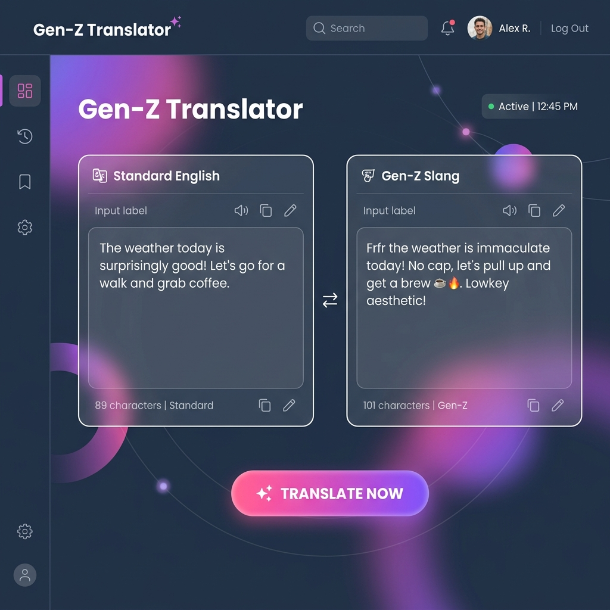

# 🗣️ Gen-Z / Gen-Alpha Translator

> **A modern, AI-powered slang translator web app.**
> Effortlessly convert Standard English into natural-sounding Gen-Z & Gen-Alpha slang, and vice versa. Built with a sleek dark UI and real-time generation powered by Google's Gemini AI.

---

## 📸 Application Preview


*A sleek dark-mode dashboard providing a seamless, real-time translation experience.*

---

## 🚀 Features

- **Bidirectional Translation**: Instantly translate "Standard English" to "Gen-Z Slang" and vice versa.
- **AI-Powered Accuracy**: Uses the **Gemini 2.5 Flash** model to generate contextual and natural-sounding slang.
- **Glassmorphic UI**: A modern interface featuring frosted glass panels, smooth animations, and a responsive layout.
- **Real-Time UX**: Instant feedback with loading indicators, error handling, and one-click clipboard copying.
- **Full-Stack Architecture**: Clean separation between a Vite React frontend and an Express.js Node backend.

---

## 🛠️ Tech Stack

### Frontend
- **React 18** (Vite)
- **TypeScript**
- **Framer Motion** (Fluid animations)
- **Lucide React** (Icons)
- **Vanilla CSS** (Custom CSS variables, Flexbox/Grid, and Backdrop Filters)

### Backend
- **Node.js** & **Express**
- **TypeScript**
- **@google/genai** (Google Gemini SDK)
- **CORS** & **Dotenv**

---

## 🚦 Getting Started

### Prerequisites
- Node.js (v18+)
- A [Google Gemini API Key](https://aistudio.google.com/)

### 1. Setup the Backend
Navigate to the `backend` directory:
```bash
cd backend
npm install
```
Create a `.env` file in the `backend` directory and add your API key:
```env
GEMINI_API_KEY=your_gemini_api_key_here
PORT=5000
```
Start the backend server:
```bash
npm run dev
```

### 2. Setup the Frontend
Open a new terminal and navigate to the `frontend` directory:
```bash
cd frontend
npm install
```
Create a `.env` file in the `frontend` directory to link the backend:
```env
VITE_API_URL=http://localhost:5000
```
Start the Vite development server:
```bash
npm run dev
```

### 3. Usage
Open your browser to `http://localhost:5173`. Select your translation direction, type your text, and hit **Translate Now**!

---

## 👤 About the Author

**Inshrah Waseem**
- **Live Demo**: [View Live Project](#) *(Link will be updated upon deployment)*
- Built as a demonstration of modern full-stack development and AI API integration.

---
*If you find this project helpful or interesting, feel free to drop a ⭐!*
